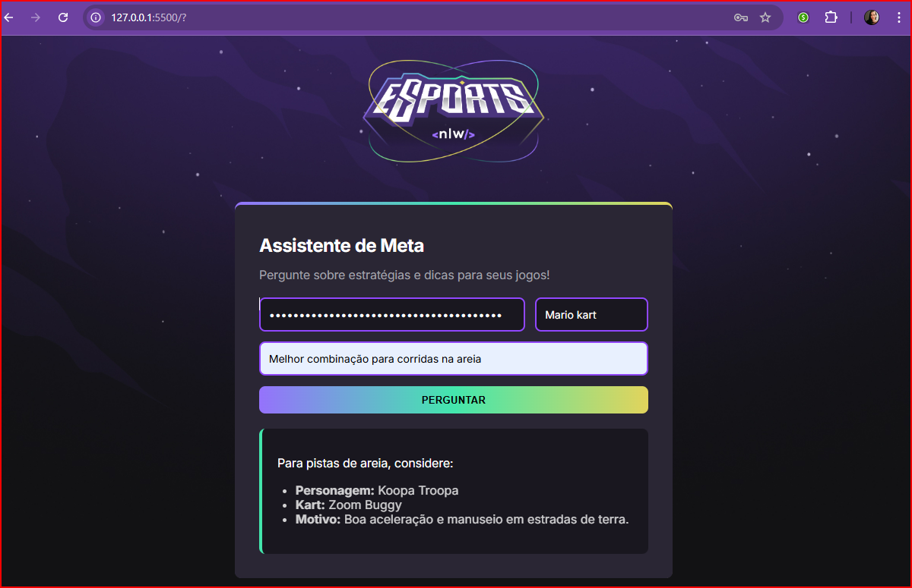
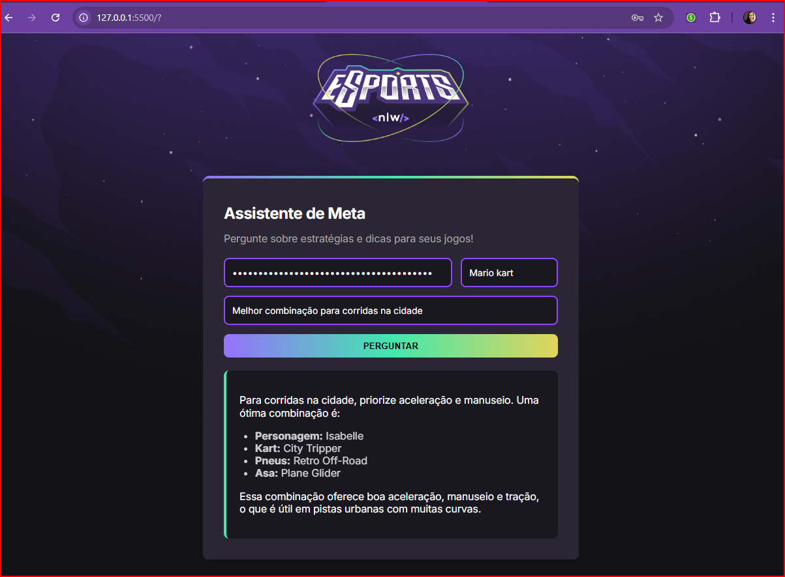

## Assistente de Meta para Jogos
Este projeto é um Assistente de Meta para Jogos, desenvolvido para fornecer estratégias, dicas e informações de "meta" (as táticas mais eficazes e populares) para jogos específicos, utilizando a inteligência artificial do Google Gemini. O objetivo é que os usuários possam perguntar sobre seus jogos favoritos e receber respostas concisas e atualizadas.

## Funcionalidades
Perguntas Contextualizadas: A IA responde a perguntas com base no jogo selecionado, focando em estratégias, dicas e "meta" atual.

Respostas Concisas: As respostas são limitadas a 500 caracteres, priorizando a objetividade.

Pesquisa Atualizada: A IA é instruída a fazer pesquisas baseadas na data atual para fornecer informações do patch mais recente do jogo.

Integração Gemini API: Utiliza o modelo gemini-2.0-flash para gerar as respostas.

## Como Usar
Para usar esta aplicação, siga os passos abaixo:

Obtenha sua API Key do Google Gemini:

Você precisará de uma chave de API do Google Gemini. Acesse o Google AI Studio para gerar a sua.

- Clone o Repositório
- Abra o Arquivo index.html:

## Aplicação

No campo "Informe a API Key do Gemini", cole a chave de API que você obteve no Google AI Studio.

Selecione o Jogo:

Escolha o jogo para o qual você deseja uma dica ou estratégia no campo "Selecione um jogo". Atualmente, "Mario Kart" está disponível como exemplo.

Faça sua Pergunta:

Insira sua dúvida sobre o jogo, por exemplo: "Melhor combinação para corridas online".

Clique em "Perguntar":

Aguarde alguns segundos enquanto a IA processa sua pergunta e gera a resposta.

Visualize a Resposta:

A resposta da IA aparecerá abaixo do formulário.
